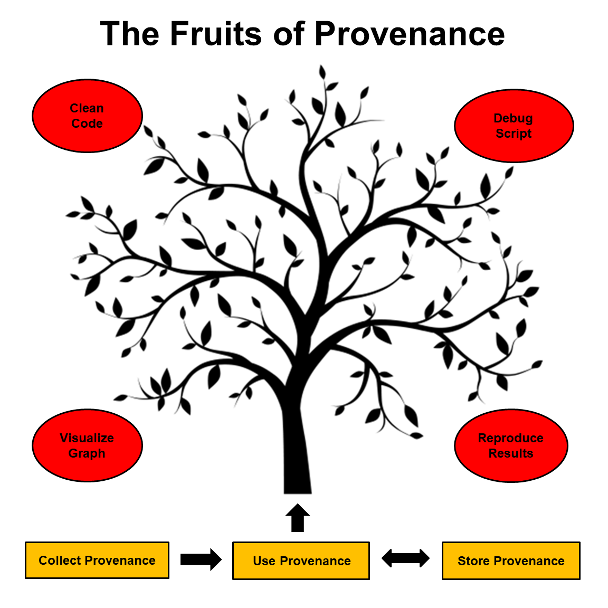

## End-To-End-Provenance

Provenance is the history of an item of data from its creation to its present state. It includes details about the steps that were executed and the intermediate values that were created in order to produce the data in its current form. For scientists, provenance can help to facilitate reproduction and validation of scientific results. But in most computer systems today, provenance is an after-thought, implemented as an auxiliary indexing structure that parallels the actual data. Our goal in this project is to design, build, and study an end-to-end system that extends all the way from original data analyses by real scientists to management and analysis of the resulting provenance in a common framework with common tools.

## Software Tools

* [R Tools](https://github.com/End-to-end-provenance/End-to-end-provenance.github.io/blob/master/RTools.md): Provenance tools for the R statistical language
* [Extended PROV-JSON](https://github.com/End-to-end-provenance/ExtendedProvJson/blob/master/README.md): An extension of the W3C PROV-JSON standard for fine-grained provenance
* [CamFlow](http://camflow.org/): A practical whole-system provenance capture mechanism for the Linux OS

## Active Contributors

* [Emery Boose](https://harvardforest.fas.harvard.edu/researchers/9), Harvard University
* [Aaron Ellison](https://harvardforest.fas.harvard.edu/aaron-ellison), Harvard University
* [Elizabeth Fong](https://www.linkedin.com/in/elizabethfongwm). Mount Holyoke College
* [Xueyuan (Michael) Han](https://scholar.harvard.edu/han/home), Harvard University
* [Matthew Lau](https://harvardforest.fas.harvard.edu/researchers/8438), Harvard University
* [Barbara Lerner](https://www.mtholyoke.edu/%7Eblerner/), Mount Holyoke College
* Khanh Ngo, Mount Holyoke College
* Erick Oduniyi, University of Kansas
* [Thomas Pasquier](https://www.cl.cam.ac.uk/%7Etfjmp2/), University of Bristol
* [Margo Seltzer](https://www.seltzer.com/margo/), University of British Columbia
* [Joseph Wonsil](https://jwons.github.io/), Carthage College

## Past Contributors

* Shay Adams, Mount Holyoke College
* Orenna Brand, Columbia University
* Vasco Carinhas, Universidad de Puerto Rico en Arecibo
* Marios Dardas, Holy Cross College
* Connor Gregorich-Trevor, Grinnell College
* Nikki Hoffler, Mount Holyoke College
* Jen Johnson, Middlebury College
* Andy Kaldunski, Ripon College
* Alex Liu, Amherst College
* Miruna Oprescu, Harvard University
* Luis Perez, Harvard University
* Lia Poulos, Mount Holyoke College
* Moe Pwint Phyu, Mount Holyoke College
* Garrett Rosenblatt, University of Rochester
* Sofiya Taskova, Mount Holyoke College
* Cory Teshera-Sterne, Mount Holyoke Colege
* Morgan Vigil, Westmont College
* Mohammed Rahman, Indian Institutes of Technology
* Yujia Zhou, Dickinson College

## Publications

* Xueyuan Han, Thomas Pasquier, and Margo Seltzer. 2018. [Provenance-based Intrusion Detection: Opportunities and Challenges](https://www.usenix.org/system/files/conference/tapp2018/tapp2018-paper-han.pdf). In Workshop on the Theory and Practice of Provenance (TaPP’18). USENIX.
* Barbara Lerner, Emery Boose, and Luis Perez. 2018. [Using Introspection to Collect Provenance in R](https://www.mdpi.com/2227-9709/5/1/12). Informatics, 5, 12.
* Thomas Pasquier, Xueyuan Han, Thomas Moyer, Adam Bates, Olivier Hermant, David Eyers, Jean Bacon, and Margo Seltzer. 2018. [Runtime Analysis of Whole-System Provenance](https://dl.acm.org/citation.cfm?id=3243776). In Conference on Computer and Communications Security (CCS'18). ACM.
* Thomas Pasquier, Matthew Lau, Xueyuan Han, Elizabeth Fong, Barbara Lerner, Emery Boose, Merce Crosas, Aaron Ellison, and Margo Seltzer. 2018. [Sharing and Preserving Computational Analyses for Posterity with encapsulator](https://ieeexplore.ieee.org/document/8409369). IEEE Computing in Science and Engineering (CiSE).
* Emery Boose and Barbara Lerner. 2017. *Replication of Data Analyses: Provenance in R*. In Stepping in the Same River Twice: Replication in Biological Research, edited by A. Shavit and A. M. Ellison. Yale University Press.
* Xueyuan Han, Thomas Pasquier, Tanvi Ranjan, Mark Goldstein, and Margo Seltzer. 2017. [FRAPpuccino: Fault-detection through Runtime Analysis of Provenance](https://www.usenix.org/system/files/conference/hotcloud17/hotcloud17-paper-han.pdf). In Workshop on Hot Topics in Cloud Computing (HotCloud'17). USENIX.
* Thomas Pasquier, Xueyuan Han, Mark Goldstein, Thomas Moyer, David Eyers, Margo Seltzer, and Jean Bacon. 2017. [Practical Whole-System Provenance Capture](https://dl.acm.org/citation.cfm?id=3129249). In Symposium on Cloud Computing (SoCC’17). ACM.
* Thomas Pasquier, Matthew K. Lau, Ana Trisovic, Emery R. Boose, Ben Couturier, Mercè Crosas, Aaron M. Ellison, Valerie Gibson, Chris R. Jones, and Margo Seltzer. 2017. [If these data could talk](https://www.nature.com/articles/sdata2017114). Nature Scientific Data, 4.
* Thomas Pasquier, Jatinder Singh, Julia Powles, David Eyers, Margo Seltzer, and Jean Bacon. 2017. [Data provenance to audit compliance with privacy policy in the Internet of Things](https://link.springer.com/article/10.1007/s00779-017-1067-4). Springer Personal and Ubiquitous Computing.

## Acknowledgments

R tool development started in 2013 at the Harvard Forest and was supported by NSF grants DEB-1237491, DBI-1459519, and SSI-1450277, a Charles Bullard Fellowship at Harvard University, and a faculty fellowship from Mount Holyoke College, and is a contribution from the Harvard Forest Long-Term Ecological Research (LTER) program. This project benefited greatly from earlier work by Lee Osterweil, Lori Clarke, and Alexander Wise at the University of Massachusetts Amherst.

CamFlow development started in 2014 at the University of Cambridge’s Opera Research Group under grant EPSRC EP/K011510/1. Later development was supported by Harvard University’s Center for Research on Computation and Society under NSF grant SSI-1450277. We also acknowledge the support of the University of Cambridge’s Digital Technology Group and the University of Bristol Cyber Security Group.

Tree silhouette from: http://www.vinylsilhouettes.com
