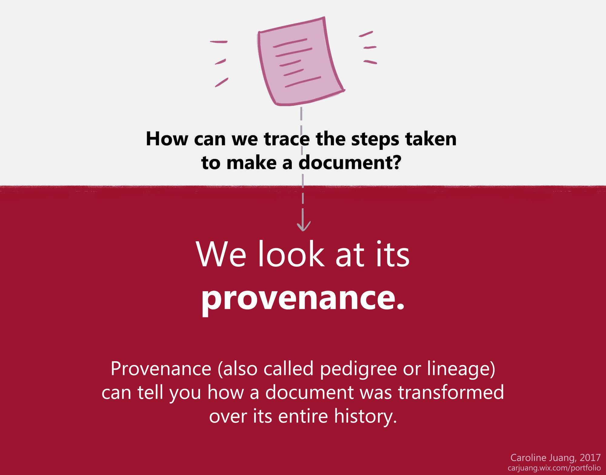
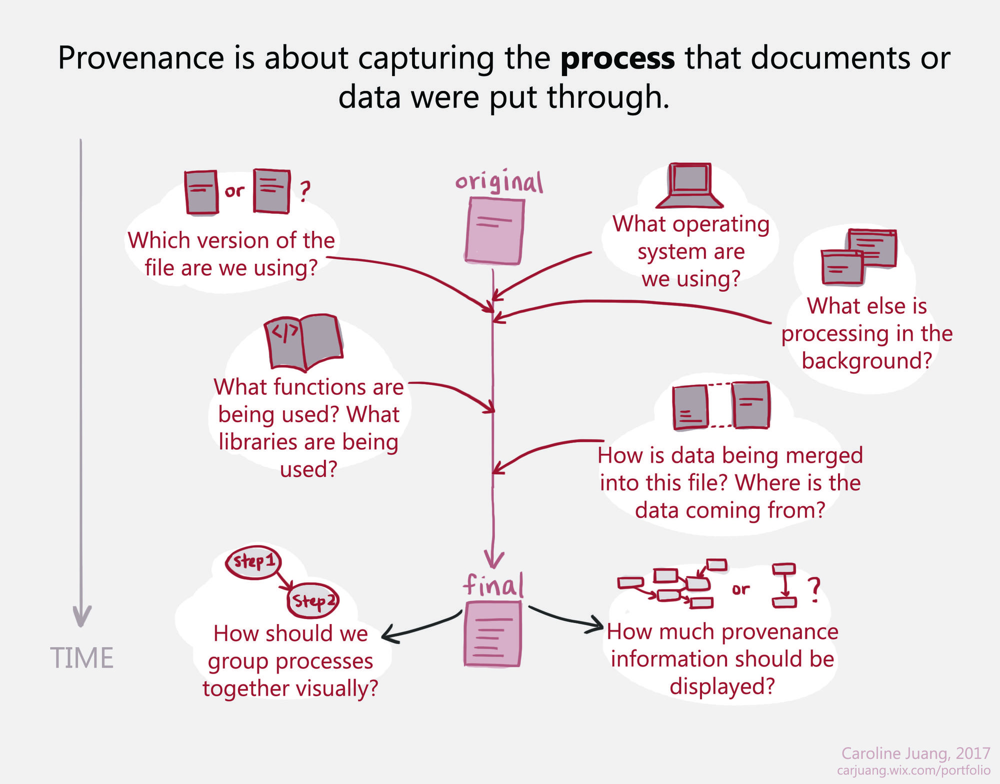

## End-To-End-Provenance

Provenance (also known as pedigree or lineage) refers to the complete history of a document. In the scientific community, provenance refers to the information that describes data in sufficient detail to facilitate reproduction and enable validation of results. In the archival community, provenance refers to the chain of ownership and the transformations a document has undergone. However, in most computer systems today, provenance is an after-thought, implemented as an auxiliary indexing structure parallel to the actual data.

Our goal in this project is to design, build, and study an end-to-end system that extends all the way from original data analyses by real scientists to management and analysis of the resulting provenance in a common framework with common tools.

## Software Tools

* [R Tools](https://github.com/End-to-end-provenance/End-to-end-provenance.github.io/blob/master/RTools.md): Provenance tools for the R statistical language
* [Extended PROV-JSON](https://github.com/End-to-end-provenance/ExtendedProvJson/blob/master/README.md): An extension of the W3C PROV-JSON standard for fine-grained provenance
* [CamFlow](http://camflow.org/): A practical whole-system provenance capture mechanism for the Linux OS
* [Unicorn](https://github.com/crimson-unicorn): An intrusion detection system
* [Xanthus](https://github.com/tfjmp/xanthus): An automated reproducibility platform

## Active Contributors

* [Emery Boose](https://harvardforest2.fas.harvard.edu/asp/hf/php/researcher_profile1.php?id=9), Harvard University
* [Aaron Ellison](https://harvardforest.fas.harvard.edu/aaron-ellison), Harvard University
* Sean Fabrega, Mount Holyoke College
* [Xueyuan (Michael) Han](https://scholar.harvard.edu/han/home), Harvard University
* Matthew Lau, Chinese Academy of Sciences
* [Barbara Lerner](https://www.mtholyoke.edu/%7Eblerner/), Mount Holyoke College
* [Thomas Pasquier](https://www.cl.cam.ac.uk/%7Etfjmp2/), University of Bristol
* [Margo Seltzer](https://www.seltzer.com/margo/), The University of British Columbia
* [Joseph Wonsil](https://jwons.github.io/), The University of British Columbia

## Past Contributors

* Shay Adams, Mount Holyoke College
* Orenna Brand, Columbia University
* Vasco Carinhas, Universidad de Puerto Rico en Arecibo
* Marios Dardas, Holy Cross College
* [Elizabeth Fong](https://www.linkedin.com/in/elizabethfongwm). Mount Holyoke College
* Connor Gregorich-Trevor, Grinnell College
* Nikki Hoffler, Mount Holyoke College
* Jen Johnson, Middlebury College
* Andy Kaldunski, Ripon College
* Alex Liu, Amherst College
* Khanh Ngo, Mount Holyoke College
* Erick Oduniyi, University of Kansas
* Miruna Oprescu, Harvard University
* Huiyun Peng, Mount Holyoke College
* Luis Perez, Harvard University
* Lia Poulos, Mount Holyoke College
* Moe Pwint Phyu, Mount Holyoke College
* Garrett Rosenblatt, University of Rochester
* Rose Sheehan, Mount Holyoke College
* Sofiya Taskova, Mount Holyoke College
* Cory Teshera-Sterne, Mount Holyoke Colege
* Morgan Vigil, Westmont College
* Mohammed Rahman, Indian Institutes of Technology
* Yujia Zhou, Dickinson College

## Publications

2022
* Barbara Lerner, Emery Boose, Orenna Brand, Aaron M. Ellison, Elizabeth Fong, Matthew Lau, Khanh Ngo, Thomas Pasquier, Luis A. Perez, Margo Seltzer, Rose Sheehan and Joseph Wonsil , [Making Provenance Work for You](https://journal.r-project.org/articles/RJ-2023-003/), The R Journal, Volume 14, Number 4, December 2022, pages 141-159.

2020
* Xueyuan Han, James Mickens, Ashish Gehani, Margo Seltzer, and Thomas Pasquier. 2020. [Xanthus: Push-button Orchestration of Host Provenance Data Collection](https://www.seltzer.com/assets/publications/precs2020-xanthus.pdf) Proceedings of the Third Annual Workshop on Practical Reproducible Evaluation of Computer Systems (Co-located with HPDC 2020).
* Aaron Ellison, Emery Boose, Barbara Lerner, Elizabeth Fong, and Margo Seltzer. 2020. [People of Data: The End-to-End Provenance Project](https://www.seltzer.com/assets/publications/e2epeople-2020.pdf).
* Matthew Lau, Thomas Pasquier, and Margo Seltzer. 2020. [Rclean: A Tool for Writing Cleaner, More Transparent Code](https://www.seltzer.com/assets/publications/rclean-2020.pdf). JOSS: The Journal of Open Source Software.
* Xueyuan Han, Thomas Pasquier, Adam Bates, James Mickens, and Margo Seltzer. 2020. [Unicorn: Runtime Provennace-Based Detector for Advanced Persistent Threats](https://www.seltzer.com/assets/publications/ndss2020-unicorn.pdf). Network and Distributed System Security Symposium (NDSS).
* Jingmei Hu, J., Jiwon Joung, Maia Jacobs, Krzysztof Gajos, and Margo Seltzer. 2020. [Improving Data Scientist Efficiency with Provenance](https://www.seltzer.com/assets/publications/icse2020-provbuild.pdf). International Conference on Software Engineering.

2019
* Sheung Chi Chan, James Cheney, Pramod Bhatotia, Thomas Pasquier, Ashish Gehani, Hassaan Irshad, Lucian Carata, and Margo Seltzer. 2019. [ProvMark: A provenance expressiveness benchmarking system](https://www.seltzer.com/assets/publications/middleware2019-provmark.pdf). International Middleware Conference.
* Thomas Pasquier, David Eyers, and Margo Seltzer. 2019. [Visonpaper -- From Here to Provtopia](https://www.seltzer.com/assets/publications/poly2019-provtopia.pdf). Towards Polystores that manage multiple Databases, Privacy, Security and/or Policy Issues for Heterogenous Data (POLY, co-located with VLDB 2019).

2018
* Xueyuan Han, Thomas Pasquier, and Margo Seltzer. 2018. [Provenance-based Intrusion Detection: Opportunities and Challenges](https://www.usenix.org/system/files/conference/tapp2018/tapp2018-paper-han.pdf). In Workshop on the Theory and Practice of Provenance (TaPP’18). USENIX.
* Barbara Lerner, Emery Boose, and Luis Perez. 2018. [Using Introspection to Collect Provenance in R](https://www.mdpi.com/2227-9709/5/1/12). Informatics, 5, 12.
* Thomas Pasquier, Xueyuan Han, Thomas Moyer, Adam Bates, Olivier Hermant, David Eyers, Jean Bacon, and Margo Seltzer. 2018. [Runtime Analysis of Whole-System Provenance](https://dl.acm.org/citation.cfm?id=3243776). In Conference on Computer and Communications Security (CCS'18). ACM.
* Thomas Pasquier, Matthew Lau, Xueyuan Han, Elizabeth Fong, Barbara Lerner, Emery Boose, Merce Crosas, Aaron Ellison, and Margo Seltzer. 2018. [Sharing and Preserving Computational Analyses for Posterity with encapsulator](https://ieeexplore.ieee.org/document/8409369). IEEE Computing in Science and Engineering (CiSE).

2017
* Emery Boose and Barbara Lerner. 2017. *Replication of Data Analyses: Provenance in R*. In Stepping in the Same River Twice: Replication in Biological Research, edited by A. Shavit and A. M. Ellison. Yale University Press.
* Xueyuan Han, Thomas Pasquier, Tanvi Ranjan, Mark Goldstein, and Margo Seltzer. 2017. [FRAPpuccino: Fault-detection through Runtime Analysis of Provenance](https://www.usenix.org/system/files/conference/hotcloud17/hotcloud17-paper-han.pdf). In Workshop on Hot Topics in Cloud Computing (HotCloud'17). USENIX.
* Thomas Pasquier, Xueyuan Han, Mark Goldstein, Thomas Moyer, David Eyers, Margo Seltzer, and Jean Bacon. 2017. [Practical Whole-System Provenance Capture](https://dl.acm.org/citation.cfm?id=3129249). In Symposium on Cloud Computing (SoCC’17). ACM.
* Thomas Pasquier, Matthew K. Lau, Ana Trisovic, Emery R. Boose, Ben Couturier, Mercè Crosas, Aaron M. Ellison, Valerie Gibson, Chris R. Jones, and Margo Seltzer. 2017. [If these data could talk](https://www.nature.com/articles/sdata2017114). Nature Scientific Data, 4.
* Thomas Pasquier, Jatinder Singh, Julia Powles, David Eyers, Margo Seltzer, and Jean Bacon. 2017. [Data provenance to audit compliance with privacy policy in the Internet of Things](https://link.springer.com/article/10.1007/s00779-017-1067-4). Springer Personal and Ubiquitous Computing.

2015
* Nikilesh Balakrishnan, Thomas Bytheway, Lucian Carata, Oliver RA Chick, James Snee, Sherif Akoush, Ripduman Sohan, Margo Seltzer, and Andy Hopper. 2015. [Recent advances in computer architecture: the opportunities and challenges for provenance](https://projects.iq.harvard.edu/provenance-at-harvard/publications/recent-advances-computer-architecture-opportunities-and) In Proceedings of the 7th USENIX Workshop on the Theory and Practice of Provenance (TaPP).

2014
* Lucian Carata, Sherif Akoush, Nikilesh Balakrishnan, Thomas Bytheway, Ripduman Sohan, Margo Seltzer, and Andy Hopper. 2014. [A primer on provenance](https://projects.iq.harvard.edu/provenance-at-harvard/publications/primer-provenance) Communications of the ACM, 57, 5, Pp. 52–60.

2013
* Michelle A Borkin, Chelsea S Yeh, Madelaine Boyd, Peter Macko, Krzysztof Z Gajos, Margo Seltzer, and Hanspeter Pfister. 2013. [Evaluation of filesystem provenance visualization tools](https://projects.iq.harvard.edu/provenance-at-harvard/publications/evaluation-filesystem-provenance-visualization-tools) IEEE Transactions on Visualization and Computer Graphics, 19, 12, Pp. 2476–2485.
* Peter Macko, Daniel Margo, and Margo Seltzer. 2013. [Local clustering in provenance graphs](https://projects.iq.harvard.edu/provenance-at-harvard/publications/local-clustering-provenance-graphs) In Proceedings of the 22nd ACM international conference on Information & Knowledge Management, Pp. 835–840. ACM.

2011
* Peter Macko, Marc Chiarini, Margo Seltzer, and SEAS Harvard. 2011. [Collecting Provenance via the Xen Hypervisor](https://projects.iq.harvard.edu/provenance-at-harvard/publications/collecting-provenance-xen-hypervisor) In TaPP.
* Elaine Angelino, Uri Braun, David A Holland, and Daniel W Margo. 2011. [Provenance Integration Requires Reconciliation](https://projects.iq.harvard.edu/provenance-at-harvard/publications/provenance-integration-requires-reconciliation) In TaPP.
* Peter Macko and Margo Seltzer. 2011. [Provenance map orbiter: Interactive exploration of large provenance graphs](https://projects.iq.harvard.edu/provenance-at-harvard/publications/provenance-map-orbiter-interactive-exploration-large-provenance) In TaPP.

2010
* Kiran-Kumar Muniswamy-Reddy and Margo Seltzer. 2010. [Provenance as first class cloud data](https://projects.iq.harvard.edu/provenance-at-harvard/publications/provenance-first-class-cloud-data) ACM SIGOPS Operating Systems Review, 43, 4, Pp. 11–16.
* Kiran-Kumar Muniswamy-Reddy, Peter Macko, and Margo I Seltzer. 2010. [Provenance for the Cloud](https://projects.iq.harvard.edu/provenance-at-harvard/publications/provenance-cloud) In FAST, 10: Pp. 15–14.
* Aaron M Ellison. 2010. [Repeatability and transparency in ecological research](https://projects.iq.harvard.edu/provenance-at-harvard/publications/repeatability-and-transparency-ecological-research) Ecology, 91, 9, Pp. 2536–2539. Publisher's Version
* Uri Braun, Margo I Seltzer, Adriane Chapman, Barbara T Blaustein, David M Allen, and Len Seligman. 2010. [Towards Query Interoperability: PASSing PLUS](https://projects.iq.harvard.edu/provenance-at-harvard/publications/towards-query-interoperability-passing-plus) In TaPP, Pp. 1–10.
Pages

2009
* Daniel W Margo and Margo I Seltzer. 2009. [The Case for Browser Provenance](https://projects.iq.harvard.edu/provenance-at-harvard/publications/case-browser-provenance) In Workshop on the Theory and Practice of Provenance.
* Kiran-Kumar Muniswamy-Reddy, Uri Braun, David A Holland, Peter Macko, Diana L MacLean, Daniel W Margo, Margo I Seltzer, and Robin Smogor. 2009. [Layering in Provenance Systems](https://projects.iq.harvard.edu/provenance-at-harvard/publications/layering-provenance-systems) In USENIX Annual technical conference.
* Kiran-Kumar Muniswamy-Reddy, Peter Macko, and Margo I Seltzer. 2009. [Making a Cloud Provenance-Aware](https://projects.iq.harvard.edu/provenance-at-harvard/publications/making-cloud-provenance-aware) In Workshop on the Theory and Practice of Provenance.
* James Cheney, Stephen Chong, Nate Foster, Margo Seltzer, and Stijn Vansummeren. 2009. [Provenance: a future history](https://projects.iq.harvard.edu/provenance-at-harvard/publications/provenance-future-history) In Proceedings of the 24th ACM SIGPLAN conference companion on Object oriented programming systems languages and applications, Pp. 957–964. ACM.

2008
* David A Holland, Uri Jacob Braun, Diana Maclean, Kiran-Kumar Muniswamy-Reddy, and Margo I Seltzer. 2008. [Choosing a data model and query language for provenance](https://projects.iq.harvard.edu/provenance-at-harvard/publications/choosing-data-model-and-query-language-provenance).
* David A Holland, Margo I Seltzer, Uri Braun, and Kiran-Kumar Muniswamy-Reddy. 2008. [PASSing the provenance challenge](https://projects.iq.harvard.edu/provenance-at-harvard/publications/passing-provenance-challenge) Concurrency and Computation: Practice and Experience, 20, 5, Pp. 531–540.
* Uri Braun, Avraham Shinnar, and Margo I Seltzer. 2008. [Securing Provenance](https://projects.iq.harvard.edu/provenance-at-harvard/publications/securing-provenance) In HotSec.

2007
* Emery R. Boose, Aaron M. Ellison, Leon J. Osterweil, Lori a. Clarke, Rodion Podorozhny, Julian L. Hadley, Alexander Wise, and David R. Foster. 2007. [Ensuring reliable datasets for environmental models and forecasts](https://projects.iq.harvard.edu/provenance-at-harvard/publications/ensuring-reliable-datasets-environmental-models-and-forecasts) Ecological Informatics, 2, Pp. 237–247.

2006
* Uri Braun, Simson Garfinkel, David A Holland, Kiran-Kumar Muniswamy-Reddy, and Margo I Seltzer. 2006. [Issues in automatic provenance collection](https://projects.iq.harvard.edu/provenance-at-harvard/publications/issues-automatic-provenance-collection) In International Provenance and Annotation Workshop, Pp. 171–183. Springer.
* Kiran-Kumar Muniswamy-Reddy, David A Holland, Uri Braun, and Margo I Seltzer. 2006. [Provenance-aware storage systems](https://projects.iq.harvard.edu/provenance-at-harvard/publications/provenance-aware-storage-systems) In USENIX Annual Technical Conference, General Track, Pp. 43–56.

2005
* Jonathan Ledlie, Chaki Ng, and David A Holland. 2005. [Provenance-aware sensor data storage](https://projects.iq.harvard.edu/provenance-at-harvard/publications/provenance-aware-sensor-data-storage) In Data Engineering Workshops, 2005. 21st International Conference on, Pp. 1189–1189. IEEE.

## Acknowledgments

R tool development started in 2013 at the Harvard Forest and was supported by NSF grants DEB-1237491, DBI-1459519, and SSI-1450277, a Charles Bullard Fellowship at Harvard University, and a faculty fellowship from Mount Holyoke College, and is a contribution from the Harvard Forest Long-Term Ecological Research (LTER) program. This project benefited greatly from earlier work by Lee Osterweil, Lori Clarke, and Alexander Wise at the University of Massachusetts Amherst.

CamFlow development started in 2014 at the University of Cambridge’s Opera Research Group under grant EPSRC EP/K011510/1. Later development was supported by Harvard University’s Center for Research on Computation and Society under NSF grant SSI-1450277. We also acknowledge the support of the University of Cambridge’s Digital Technology Group and the University of Bristol Cyber Security Group.

We acknowledge the support of the Natural Sciences and Engineering Research Council of Canada (NSERC).

Cette recherche a été financée par le Conseil de recherches en sciences naturelles et en génie du Canada (CRSNG).

